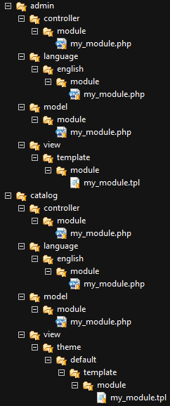
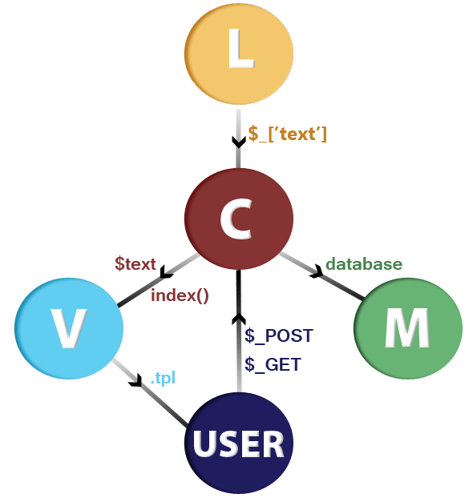

MVC Structure
=============

The basic file structure for your extension will be divided into two sections, the admin and the catalog folders. The contents of each folder will follow the MVC-L framework respectively, with the difference that the admin will deal solely with backend functionality, and the catalog with frontend functionality.

Users of your extension will interact and configure its settings in the administration side of the store. Therefore, the files in the admin folder will handle any changes to its settings, the way the extension is displayed in the admin panel, install/uninstalling the extension, etc. Likewise, the way the extension is displayed and how it works in the front end of the store will be handled by the files in the catalog folder.

The image above displays a skeleton of the directory structure that your extension should follow. A good way to get started with your module is to duplicate the folder structure and create the files above.

All extensions will require at least a single file in each of the view and controller folders. Most will require a file in each of the model and language folders. Usually the files have the same name, except the view file has a different suffix (.tpl). We will go through these files one by one.