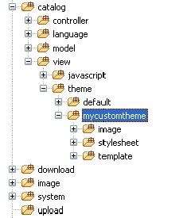

Override System
===============

Arastta is built using [MVC design pattern](docs/developers/mvc-structure) which allows separation of concerns between the data and the presentation. In our case, the `view` part is where all the theme related code is placed.

All the files related to the admin panel are placed in the `admin` directory. Files dealing with store front are placed in the `catalog` directory. What we are really interested in is the `catalog/theme/default` directory which includes the only built-in theme provided by Arastta.

Arastta use fallback system, it's mean that when it doesn't find certain template in your theme, it will find on `default` theme folder. So to make a new theme, you don't need to copy all file from default theme. The great benefit of this is that you only need to edit very few files to make a completely different looking theme.

Default theme structure
-----------------------

* **image**: As you've likely guessed, all the image files related to the theme go here.

* **stylesheet**: Skinning related code, which is likely to be CSS files, will go here.

* **template**: As the name suggests, you can find all the store front template files here. All the template files are organized in a modular way to keep things neat and clean.

Creating a new theme
--------------------

In order to override the output, you must create a new theme. Let's create a new directory, named `mycustomtheme` underneath `catalog/view/theme` directory. After that, you need to create three more directories within the mycustomtheme directory: `image`, `stylesheet`, and `template`.

Overriding the default theme
----------------------------

**NEVER** copy the entire `default` folder and just rename it. This will make updating much more difficult. As mentioned above, the default theme fallback system does all the job for you. Only copy files from the `default` folder as needed when making custom changes to the structure of those pages.

Copy the followings in order to override the output:

* catalog/view/theme/default/stylesheet/ALL_FILES 
* catalog/view/theme/default/image/ALL_FILES
* catalog/view/theme/default/template/common/header.tpl

Open the `catalog/view/theme/mycustomtheme/template/common/header.tpl` file, find and replace all references to `default` with `mycustomtheme` in that file.

Finally, go to admin panel, then settings page and change the theme from `default` to `mycustomtheme`.