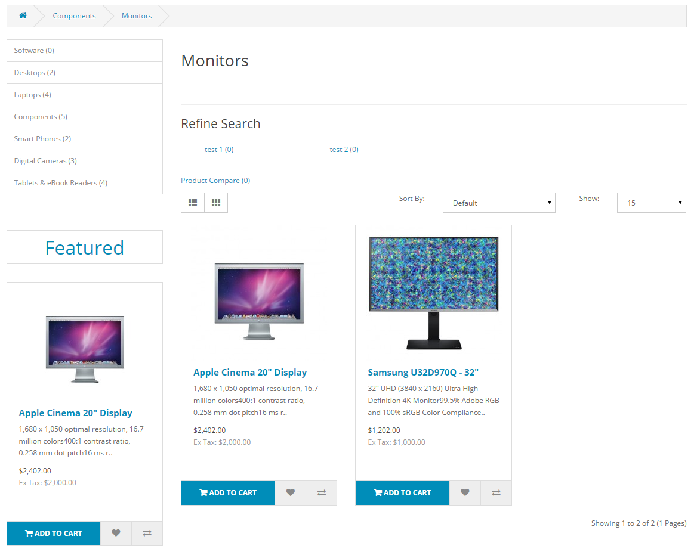

Editing a Module
========

   You can switch between Basic and Advanced modes from the tabs below.

<ul class="uk-tab" data-uk-tab="{connect:'#doc-tabs', animation: 'fade'}">
    <li><a href="">Basic Mode</a></li>
    <li><a href="">Advanced Mode</a></li>
</ul>

Modules can vary widely in purpose and function, so naturally, customizing a module to fit a particular store may vary between modules. In general, there are 4 main features of modules that can be tinkered with in the Module section:

- Status
- Layout
- Position
- Sort Order

Status
--------

Disabling or enabling the status of the module will affect the visibility of the module on the store website. Disabling a module is different from uninstalling the module. Disabling the module keeps all the module information available to be edited in the administration, while hiding it from the store front. Uninstalling the module will remove the store module information. Selecting "Enabled" will make this module publicly available on the pages selected for the store.

Layout
-------

The layout affects which pages the module will be included on. The pages available are listed in the screenshot below. If the module needs to be included on multiple pages, you must individually "Add Module" for each page. The Layout can only select one page at a time.

<ul id="doc-tabs" class="uk-switcher uk-margin">
    <li markdown="1"></li>
    <li markdown="1"></li>
</ul>

The screenshot below shows the Featured module, which displays a list of specified products on the left side of a random Category page. This was achieved by selecting "Category" under Layout. The Featured Products box will be available on every Category page. Selecting a layout page type will add it to every page of that type. Core modules can be assigned to layout pages, but not individual pages.

Position
--------

The Position selection determines where the modules will be displayed on the page. On the page types selected in Layouts, the module box can be at the top, bottom, left, or right side of a page.

Using the same module from the Layout section, we will change the Featured box on the category page from the left column, to the top, by selecting "Content Top" under Position (below).

The Featured box with its specified products is listed above the category products in the category page, moved from its original position on the left side.

Sort order
-----------

The sort order affects the order of a module in relation to other modules in the same position. **Layout Manager** allows you to assign modules to them by just **dragging & droping**. Positioning a module in **content top, bottom, column left** or **right** has never been easier.