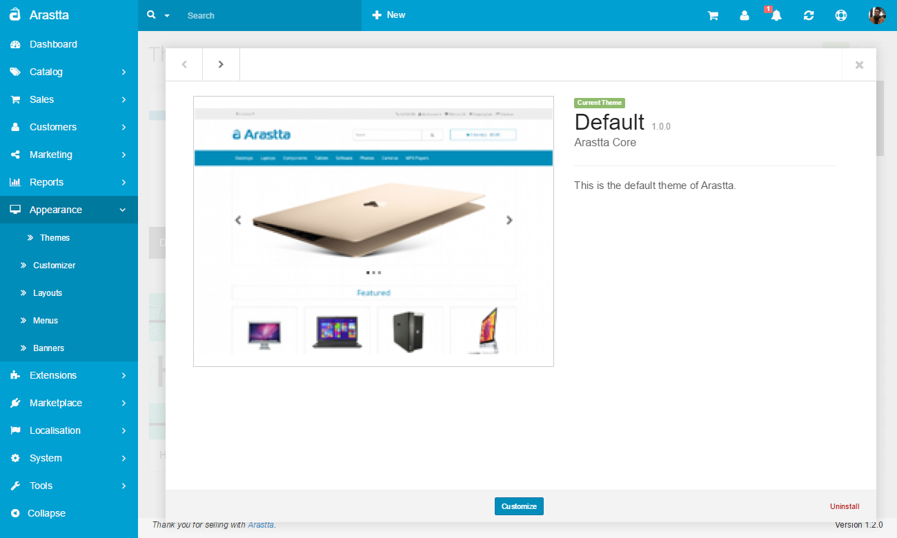

Themes
=====

The **Appearance Themes Screen** allows you to manage your Themes. That means you can **install**, **preview**, **uninstall** Themes, **activate**, and **update** Themes.

An Arastta Theme is a collection of files that work together to produce a graphical interface with an underlying unifying design for a store. These files are called template files. A Theme modifies the way the site is displayed, without modifying the underlying software. Themes may include customized template files, image files (*.jpg*, *.gif*), style sheets (*.css*), custom Pages, as well as any necessary code files (*.php*).

Manage Themes
------------

The current active Theme appears first in the upper left corner. Initially, as part of the Arastta installation process, the Arastta default theme is displayed as the active Theme.

A small screenshot of the Theme is shown. If you roll over the image with your cursor, a "**Theme Details**" button appears. Click it and you'll be provided with the name of the Theme, the Theme version, the Theme author, and a short description of the Theme. Additional buttons are below that activate specific current theme appearance screens that correspond to the menu picks on the left.

Available Themes
------------------------------

The remainder of the Manage Themes screen shows the other Themes that are installed. As with the Current Theme image, a small screenshot of each Theme is shown. Roll over the image to show "Theme Details", "Set Default", and "Live Preview" buttons. Click the "Theme Details" button to see, along with the name of the Theme, the Theme version, and the Theme author, a short description of the Theme. The Theme Details modal has buttons displayed to Set Default, Live Preview, and links to Uninstall, and if available, upgrade the Theme.

Install Themes
---------

Themes can be installed in several ways. Here you can learn [how to install a new theme](docs/faq/theme-installation).