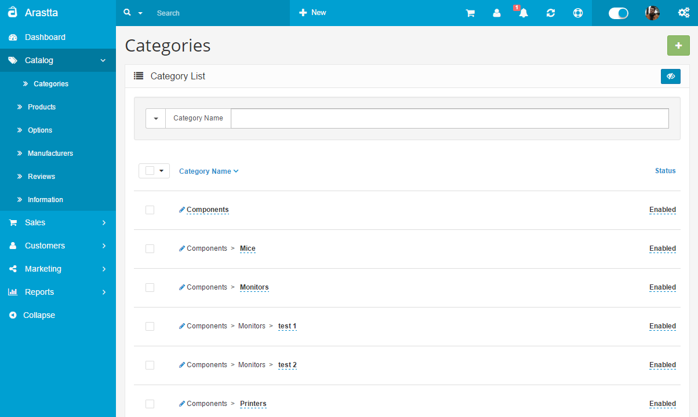
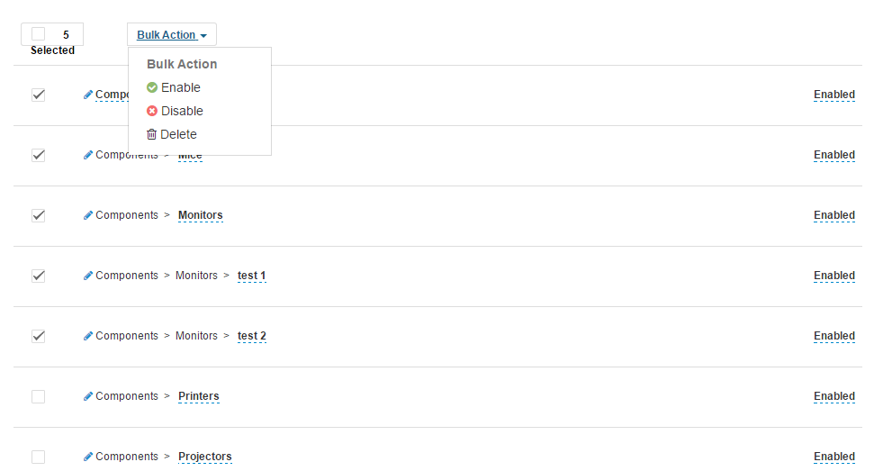
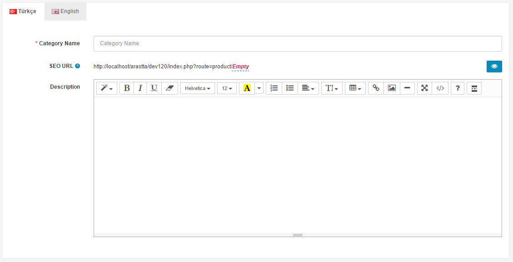
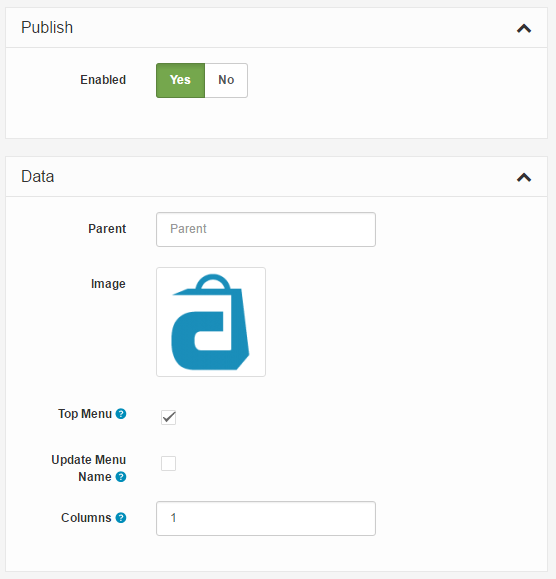

Overview
========

Catalog → Categories
----------

   You can switch between Basic and Advanced modes from the tabs below.

<ul class="uk-tab" data-uk-tab="{connect:'#doc-tabs', animation: 'fade'}">
    <li><a href="">Basic Mode</a></li>
    <li><a href="">Advanced Mode</a></li>
</ul>

<ul id="doc-tabs" class="uk-switcher uk-margin">
    <li markdown="1">Each product in Arastta is filed under one or more Categories. This aids in navigation and allows products to be grouped with others of similar products.

Each Category may be assigned to a Category Parent, allowing you to set up a hierarchy within the Category structure. In creating Categories, recognize that each Category Name must be unique. Thus, even if two Categories have two different Parents, they must still have different names.</li>
    <li markdown="1">In the default theme of the store front, parent categories are listed in the top menu of the home page, and on the left side of product pages. This navigational feature is used to guide customers to similar products within the same category. Exposing customers to different products within a category lets the customer compare the similarities and differences between products to make the most informed purchase. When adding products to the store, you will be asked for a product category to sort them in. It is a good idea to establish these categories before adding products, to save yourself the trouble of adding the category name to the products later.

<i class="uk-icon-exclamation-circle"></i> When adding a product without a product category, the product will not show up under any categories in the front end of the store. The product page can only be accessible if the customer types in the product name, one of the product tags in the search box, or visits the product through a manufacturer page. If you want this product to be more visible to your customers in the store front, we suggest that the category is created prior to adding the product.
</li>
</ul>

To access the Category page in the administration, hover over the Catalog button and click on Category in the drop-down. You will be a directed to a page that displays the category names of the store products (as seen below).

<ul id="doc-tabs" class="uk-switcher uk-margin">
    <li markdown="1">

The categories above were included with the default products provided by the install. You may delete them to make room for the store's product categories. To delete, check the box next to the row that the category is listed on. When the categories selected for deletion are checked, "**Delete**" can be clicked on in the **Bulk Action** field on top of categories. This should remove the product categories completely.</li>
    <li markdown="1">

The categories above were included with the default products provided by the install. You may delete them to make room for the store's product categories. To delete, check the box next to the row that the category is listed on. When the categories selected for deletion are checked, "Delete" can be clicked on in the upper right corner. This should remove the product categories completely.</li>
</ul>

<i class="uk-icon-info-circle"></i> The ">" symbol points from a parent category to a sub-category. "Laptops > Windows" indicates that "Windows" is a sub-category sorted under the parent category "Laptops".

<ul id="doc-tabs" class="uk-switcher uk-margin">
    <li></li>
    <li markdown="1">The Sort Order indicates the order that the categories are displayed in the top menu and category box on the product page. Desktop (sort order-1) will be sorted above Laptops & Notebooks (sort order-2) because it has a higher priority.

<i class="uk-icon-info-circle"></i> Leaving "Sort Order" blank will organize the sections in alphabetical order.
</li>
</ul>

Clicking "**Edit**" under "Action" will direct the administrator to a form to change the category information. Clicking "**Add New**" will allow the shop owner to insert more categories to the site.

<ul id="doc-tabs" class="uk-switcher uk-margin">
    <li markdown="1">Using Bulk Actions and Quick Edit
-----------------------------

Bulk Actions describe the process to be performed on particular Categories. These Actions can be performed on one, or more Categories, at one time, if those Categories have been previously selected. Bulk Actions are available, when appropriate, as choices in the Actions pulldown box, above each Table. There are three Bulk Actions allowed, **Enable**, **Disable**, and **Delete**.

The following fields can be change via the Quick Edit Action: **Category Name** and **Status**.

</li>
    <li></li>
</ul>

Create a category
-----------------

<ul id="doc-tabs" class="uk-switcher uk-margin">
    <li markdown="1">There are eight pieces of information associated with each new Category: the Name, SEO URL, Description, Enabled, Parent Category, Image, Top Menu, and Columns.

- **Category Name**: To reiterate, the Category Name must be unique.
- **SEO URL**: Do not enter site name or parent category, just the category URL. Leave empty if you want to be generated by the system automatically based on category name.
-  **View Category button**: Allows you to view the category before officially publishing it.
- **Description**: text that will describe this category on the category page, to be viewed by the customers in the store front of the shop.

- **Enabled**: Selecting "Yes" makes the category publicly available in the store front. Selecting "No" will hide the category from the store front, but will still be available for editing purposes in the administration.
- **Parent Category**: Categories are arranged in a hierarchical structure; with the parent category always on top. You may choose to create a category under a parent category, turning it into a sub-category. In the category list the category will be displayed as "**Parent Category > Sub-Category**". If "None" is selected, the category created will be a parent category.
- **Image**: Select the main image for the product page and the thumbnail for product listings. See [Image Manager](docs/faq/image-manager) for more information on how to upload an image using the image manager tool.
- **Top Menu**: Checking this section will display this category in the top menu of every page. If no selection is made, it will not be displayed.

<i class="uk-icon-check-circle"></i> The top menu only displays parent categories. If this category is a sub-category, it will not be displayed in the top menu.

- **Update Menu Name**: If you checked this field will update the Menu Category name.
- **Columns**: This number controls how many sub-categories are displayed when selecting the parent category.

<i class="uk-icon-exclamation-circle"></i> Shop owners with many product sub-categories may need to pay special attention to how many columns are allowed. If all the available sub-categories are allowed for a product category, the entire store page in the store front will be filled with sub-categories when hovered over.

</li>
    <li markdown="1">Before you learn how to add products, you will need to understand how to create product categories. Product category is an essential organizational feature in Arastta. Arastta organizes the structure of an online store around these product categories. Every product category gets their own space in the store to display all the available products for that category.

Organizing products into categories is useful for navigating a store's inventory in both the store front and administration side. In the administration, creating categories for products will help the shop owner keep track of specific products within a category. In the store front, customers will be able to browse their favorite products by category. Category pages can be accessed in the top menu and from the category box in the product page.

<i class="uk-icon-check-circle"></i> Before inserting products into Arastta, you should take some time to brainstorm and establish categories for your products. Think of how the products in your store can be organized into groups in a logical manner. Generally, you would want to start with creating a broad parent category, and move narrower into specification with each sub-category below it. For example, a broad category such as Electronics is a good parent category. Under the Electronics, a sub-category named "Computers" can be created; and under that category, "Laptops". You can see how each category becomes more specific as we progress. Putting effort into this task will improve a store's usability, ultimately bringing customers to other products in the store that may interest them.

Go to **Catalog > Category** in the administration. If this is your first time in the category section you will see a list of categories created for the default products. You should feel free to delete them to make room for your store's products. To create a new category for products you can click "**Add New**" in the upper right corner. You will be directed to the category's information page. Category information can be filled out under three tabs: "General", "Data", "Design".</li>
</ul>
