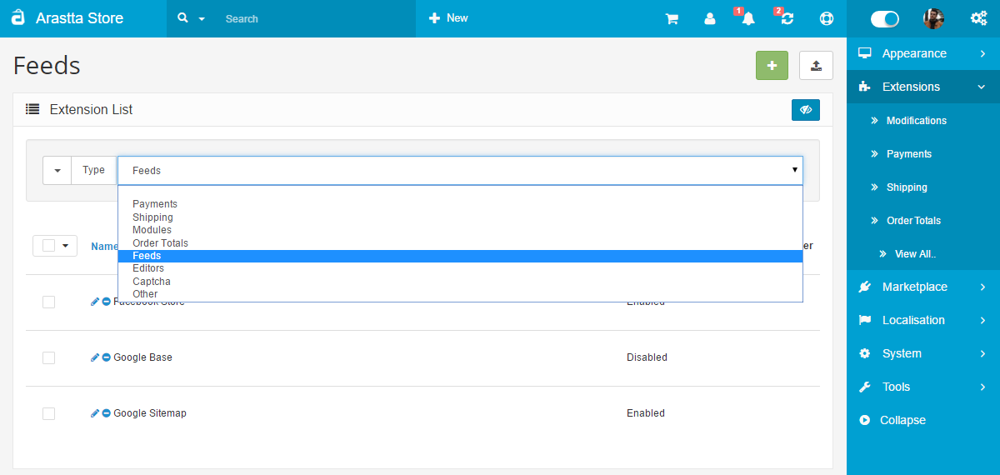

Feeds
=====

Facebook Store
-----------------

   You can switch between Basic and Advanced modes from the tabs below.

<ul class="uk-tab" data-uk-tab="{connect:'#doc-tabs', animation: 'fade'}">
    <li><a href="">Basic Mode</a></li>
    <li><a href="">Advanced Mode</a></li>
</ul>

Facebook Store is a great solution for today’s eStore owners since the social media is very important to market your products and gain more customers from all over the world. And Facebook is one of the most popular social channels where you can find millions of people from various interests. So, Facebook Store let’s you turn those people into customers by publishing your products easily on your Facebook page. You can publish any of your products, and once your visitors click any product or category, they will be redirected to your site’s relative page and they can complete the order on the site. That’s it!

Here you can get more information about the [Facebook Store](docs/user-manual/extensions/facebook-store).

Product Feeds
-------------

The Product Feed extension lets you customize how you want the products of your Arastta store to be viewed and listed by search engines like Google. To utilize this feature, you must compile a [product feed](http://en.wikipedia.org/wiki/Product_feed) of your store's products. The store's product feed can be compiled using XML or manually entering product information into a spreadsheet program.

Google Base and Google Sitemap
------------------------------

The Arastta package lets you connect to two product feed tools, Google Base and Google Sitemap. You need to create an account at the [Google Merchant](http://www.google.com/merchants) Center to access these tools. Google Base requires the user to upload product information in product feeds so that they can show up in Google's search engine. The product feed created for Google Base needs to follow Google's specifications, which can be viewed in Google's support [FAQ](https://support.google.com/merchants/answer/188494?hl=en#US). Google Sitemap uses a data url from the store website to provide information to its search engine to crawl the store's website.

In the edit section of Product Feeds, you must link to the store's Data feed urls obtained from the Google Merchant center.

<ul id="doc-tabs" class="uk-switcher uk-margin">
    <li></li>
    <li></li>
</ul>

### Support

To receive support for the Product Feeds extensions, please visit the [Feeds Extension](forum/categories/listings/extensions) section of the support forum.
