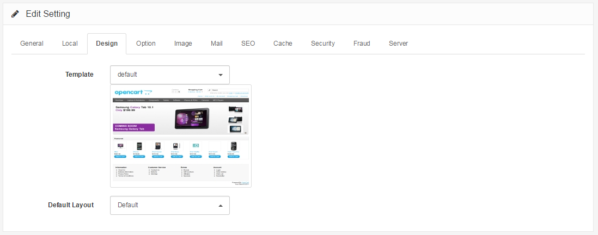
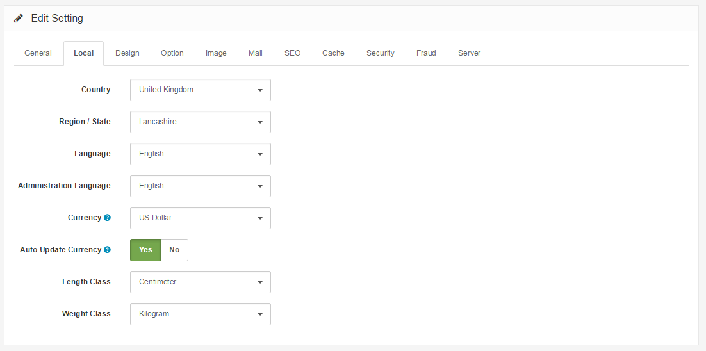
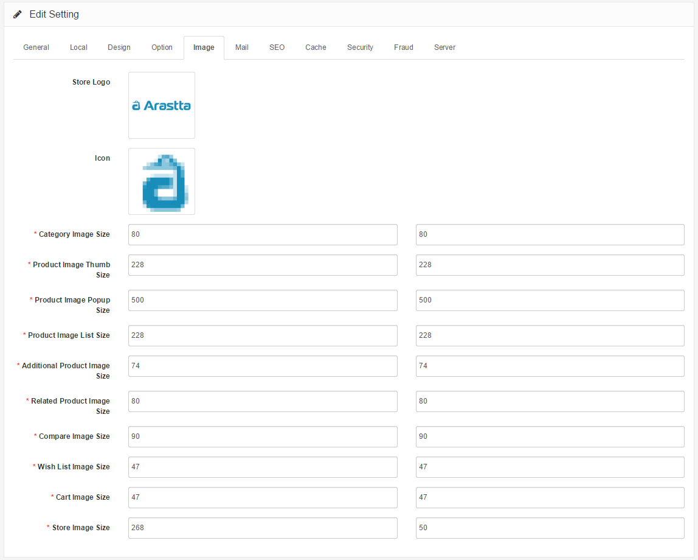
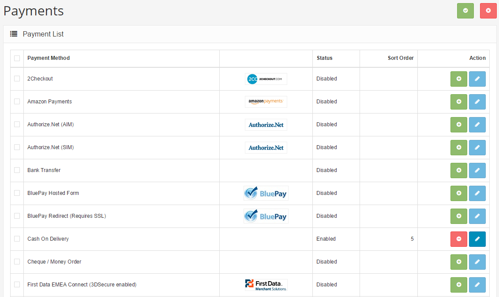
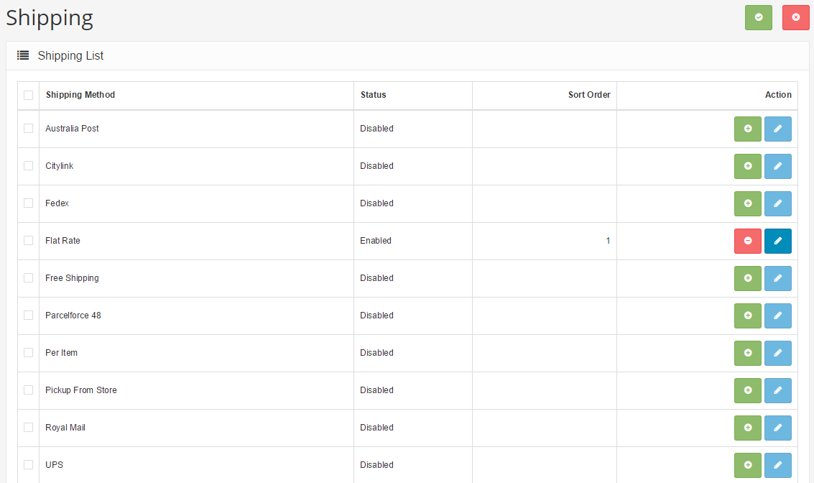

Getting Started
===============

There are a number of steps required after installing Arastta to get started selling from your online store. This page is a helpful guide to getting started. An Arastta store is comprised of a [Frontend ](docs/user-manual/store-front)and [Admin interface](docs/user-manual/admin/overview). This guide will primarily focus on Admin interface functions and settings. These settings should be tested on the frontend before your site is launched. Following the steps in this guide will get your store to a ready to use state from installation. This guide assumes that you have admin login credentials and are able to login to your store's Admin interface via <yourdomain.com>/admin, for example: [http://demo.arastta.org/admin/](http://demo.arastta.org/admin/).</yourdomain.com>

System Settings
---------------

Most [General Settings](docs/user-manual/system/settings/general) are required. Under General Settings you will need to set your store's name, owner, address, email and phone number. These will be used for your store's contact page and order invoices.

Design Settings
--------------

[Design Settings](docs/user-manual/system/settings/design) allow you to choose the default or custom templates.

Local Settings
--------------

[Local Settings](docs/user-manual/system/settings/local) allow you to choose the Country that your store is operating from. You can also choose the default currency for your store. If your store accepts multiple currencies, you will need to select whether Arastta should automatically update based on current exchange rates.

Image Settings
--------------

Next, you will need to select a logo for your store and upload it via the [Image Settings](docs/user-manual/system/settings/image) tab. The logo must be a suitable size and shape for your theme, and should ideally be a jpg or png file. You can also choose a favicon at this point. This is the small image that displays in a browser when you visit a site. Typically, favicons are 16px by 16px, and Arastta requires a png file for favicons.

Server Settings
---------------

There are two important settings under the Server tab of your Arastta store's System Settings.

1. SEO URLs. If you wish to have search engine optimized URLs in your store then you will need to set this to yes. You will also need to follow the instructions on setting up SEO URLs to make sure these work correctly, but it is an important step for getting the best possible result for your store from search engines.
2. The Display Errors option should always be set to No for a live store. This will prevent your customers seeing any errors in your store's code while using your site. Your developer will still be able to diagnose and repair these issues using the error logs.

Accepting Payments and Adding Taxes
-----------------------------------

Once your settings are correct, you will need to select the payment gateway you wish to use. If your store needs to charge taxes on purchases, these should also be setup via your admin interface as described below.

### Payment Gateways

Arastta supports many [Payment Gateways](docs/user-manual/marketplace/payments) out of the box. If your payment gateway is not supported, you can find and install additional gateways from the Arastta extension store. In order to choose the payment gateway your store will use, go to the [Marketplace](docs/user-manual/marketplace/overview) menu, and the [Payments ](docs/user-manual/marketplace/payments) submenu. This page will show you a list of all the available payment gateways. Your store can use more than one payment gateway.

In order to enable payment gateways first click the Install link corresponding to the gateway you wish to enable, then click the Edit link to set it up for your payment account. The Order field on each payment gateway's settings allows you to select the order in which payment options are displayed on your checkout page. Lower numbered payment options will always be shown above higher numbered options.

### Taxes

Arastta offers a number of different [Tax ](docs/user-manual/localisation/taxes) options by default. Taxes are location dependent, so you can charge different tax rates to customers in different geographical locations, according to local tax rules. Tax rates are set up under Localisation > Taxes > Tax Rates. If your required tax rate is not already present, you will need to create a new tax rate and add it. For example, the Tax Rate applicable to New Zealand is GST which is currently at 15%. New Zealand stores should therefore create a new Tax Rate called GST, set to 15%, and applicable to customers in the Geo Zone of New Zealand.

If you have product specific tax rates, you need to define each of these tax rates under the Tax Rates page. You will later choose which tax rate applies to each product, so you will be able to manage your product specific taxes at the product level.

Shipping Method
---------------

Stores selling tangible goods will need to edit their shipping options. Shipping methods are selected under the Marketplace > Shipping menu item. Just as with the Tax Rates above, you will need to Install and Edit the settings for the Shipping Methods your store will support. The documentation contains full instructions on setting your [Shipping Method](docs/user-manual/marketplace/shipping).

Inventory Management
--------------------

Arastta's installation includes demonstration data to help you see how to setup your Arastta store's inventory. This includes [Categories](docs/user-manual/catalog/categories/overview), [Manufacturers](docs/user-manual/catalog/manufacturers), [Options](docs/user-manual/catalog/options), [Attributes](docs/user-manual/catalog/attributes) and [Products ](docs/user-manual/catalog/products/overview) and some home page Banners. These are the Apple iPods that you see when you first visit your store's frontend after installation. In order to get started with your store, you will need to replace these demo items with the actual categories, manufacturers and products your store will sell. There are two recommended ways to do this:

1. You can manually edit these under the Catalog menu in your Arastta store's admin.
2. You can use an import tool to simplify the upload of your products in bulk. This is more practical for larger inventories or dropshippers, and will allow you to remove all existing items and replace them at the same time.

Extensions, Modules and Themes
------------------------------

Arastta functionality, look and feel are all controlled by modules and themes. The final step to get started with Arastta is to check your Appearance > Layouts > Modules page to ensure the functionality you want is enabled. The default banners can be modified under System > Banners, or removed via the Slideshow module at this point. You can also choose other modules that you wish to display, and the pages you wish to display them. The Arastta defaults are sensible and will not necessarily need editing to get started, except for the default home page banners, which are for demonstration purposes only.

If you do not find the functionality you need in your store, you can often add it as a [3rd Party Marketplace](docs/user-manual/extensions/modules/3rd-party).
