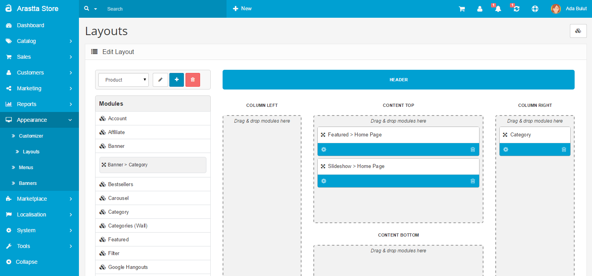

Layouts
=======

The Arastta default store provides the following page layouts:

- Account
- Affiliate
- Category
- Checkout
- Contact
- Default
- Home
- Information
- Manufacturer
- Product
- Sitemap

If you haven't done so already, you should take some time to [browse the store front](docs/user-manual/store-front). To become familiar with layouts available in Arastta, you should visit the different page types of your store front. The Manufacturer page layout has a different type of layout than the Checkout page, which has a different page layout than the Information page, and so on. It's good to see how these layouts arrange themselves, to discover how positioning a module from the Extensions section will affect the overall look of the page.

Creating a layout page from scratch takes some knowledge of web design and development. Once a layout page has been created, you should upload the files with an FTP client.

The location of the layout pages in the default theme is visible under /catalog/view/theme/default/template/ in the Arastta directory. You can see that all the page layouts from the default are included as folders above. To add a new layout page, you would need to upload the files under a new layout folder.

After the new layout page is uploaded to the location above, it can added to the store by clicking the "Insert" button under System > Design > Layout. The new layout will require a layout name, the store the layout will be added to, and a route. The route is the folder name that the layout files are included in. Arastta knows to search for the folder under /catalog/view/theme/default/template/ in the store directory, so only the folder name is required.

Clicking "Add Route", then "Save" will make the new layout available in the store. See [Modules ](docs/user-manual/extensions/modules/overview)for more information on how to add a module to a specific layout page.
