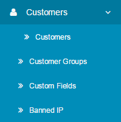
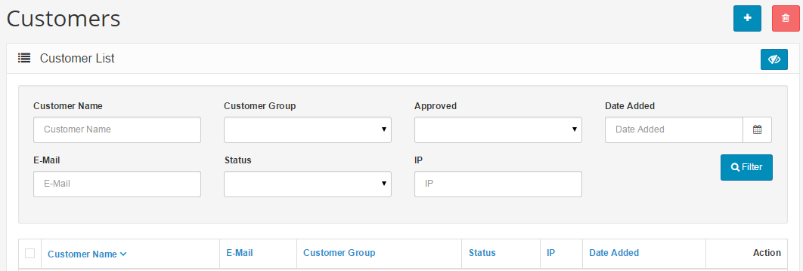
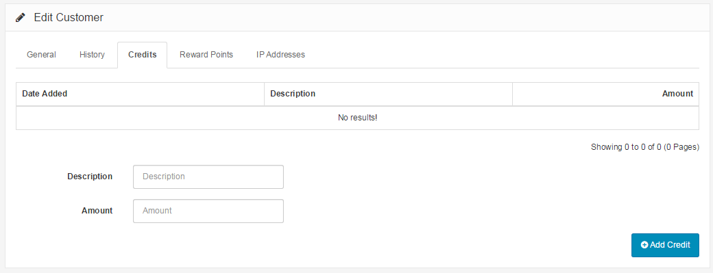

Overview
=========

Managing customers
------------------

Shop owners should know who their customers are and how to manage their information. In the administration, customer information will need to be stored efficiently to remember any credits made with their account. To access customer information, you can log into the administration panel of the Arastta store. The Customer management sections are located under **Sales > Customers**. There are three sections used to manage customer information: **Customers**, **Customer Groups**, **Custom Fields** and **Banned IP**.

Customers
---------

When a customer creates an account or completes the checkout process, Arastta will store their information automatically in the administration to be accessed under **Sales > Customers > Customers**. A complete list of customers will be displayed on this page, along with the following information:

- **Customer Name**
- **E-mail**: Saves the email address for confirmation emails, notifications, newsletters, etc.
- **Customer Group**: A designated group of customers used to apply discounts/specials and send group emails.
- **Status**: Denies or approves customer account login.
- **Approval**: Approves the customer account after creation.
- **IP**: An address that reveals the location of the customer.
- **Date Added**: The date the customer account was created.

### Searching for a customer

In the case of locating a specific customer, type in the necessary customer information in the spaces below. Clicking "**Filter**" will locate specific customers matching the information typed in. This saves you the time of sorting through pages of customers to find a specific person.

### Manually adding a new customer

Customer accounts usually don't need to be created in the administration panel, since account information is stored automatically upon user creation in the store front. You might find yourself needing to manually input customer information into Customers. Clicking the "**Add New**" button on the Customer page will lead you to a form where customer information can be filled in.

### General tab

The general tab asks for the customer's basic information: "**First Name**", "**Last Name**", "**E-Mail**", and "**Telephone**". A password must be submitted for the customer to access the site privately. Under "Confirm", retype the password. Enabling "Newsletter" will put this customer on the e-mail newsletter list. Later on, you can categorize this customer into a specific customer group. The customer will be categorized into "**Default**" if there isn't a defined customer group available. The status determines whether or not this customer will be allowed to access the store's login.

### Adding an address

Obtaining the customer's address is important for shipping products to the customer. Clicking the Green '+' button will add the "Address 1" address form. You may add as many addresses as needed with the green button, or remove them with the red '-' button. The "**First Name**", "**Last Name**", "**Address 1**", "**City**", "**Postcode**", "**Country**", and "**Region/State**" are required fields in the address form.

When the above fields have been filled in, click "Save" to save the form to the administration. You don't need to worry about the customer's IP address for keeping track of credits, unless you need to know your customer's regional location.

### Modifying existing customer information

The Customer section will mostly be used to modify existing customer information, for operations like changing the Customer Group, rather than adding a whole new customer. When editing customer information, you can modify general information, include new addresses, manage credits, and add reward points. Under Action, clicking "**Edit**" for a customer listed on the Customer page will direct you to the customer information page. You can change customer information in the General tab.

### Managing credits

The Credits tab is where you may manually add a credit to the customer. To do so, enter in the description of the credit, the amount paid, and click "**Add Credit**". Every credit added will be listed in the Credits tab.

### Adding reward points

If you choose to enable reward points for the store, points may be manually added to specific customers in the admin side of your store. Reward points can be added to products, which will be assigned to customers once they purchase that product. If you choose to add reward points directly to customers, you can include a reason in the description and the amount of points under the Reward Points tab. If you need to subtract points from a customer, you can enter in a negative number into the points field.

A list will be displayed of every addition and subtraction event in the customer's profile. The balance will display the total reward points accumulated by the customer. Arastta calculates the balance of negative and positive numbers to subtract from or add to the total.

### IP Addresses

An [IP Address](http://en.wikipedia.org/wiki/IP_address) will reveal the location of customer's computer network. There are many website services available to shop owners, that will give the location for an IP address.

<i class="uk-icon-info-circle">  The IP address cannot be added or modified for a customer in Arastta. The IP address will be collected from the customer automatically by Arastta and added to their customer information.</i>

Approving new customers
-----------------------

Customer accounts need to be approved before they can access their account in the store. In the [Dashboard](docs/user-manual/admin/overview/) page, the amount of customers needing approval is tabulated in the Overview section. Go to **Sales > Customers > Customers**, and find any customers that list "No" under the Approved column. Check those customers, and click the "Approve" button in the right corner.
