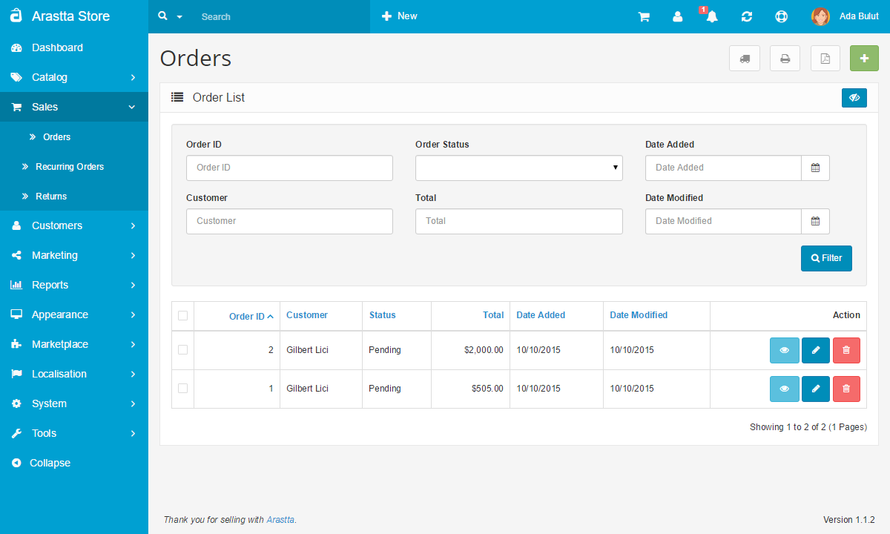
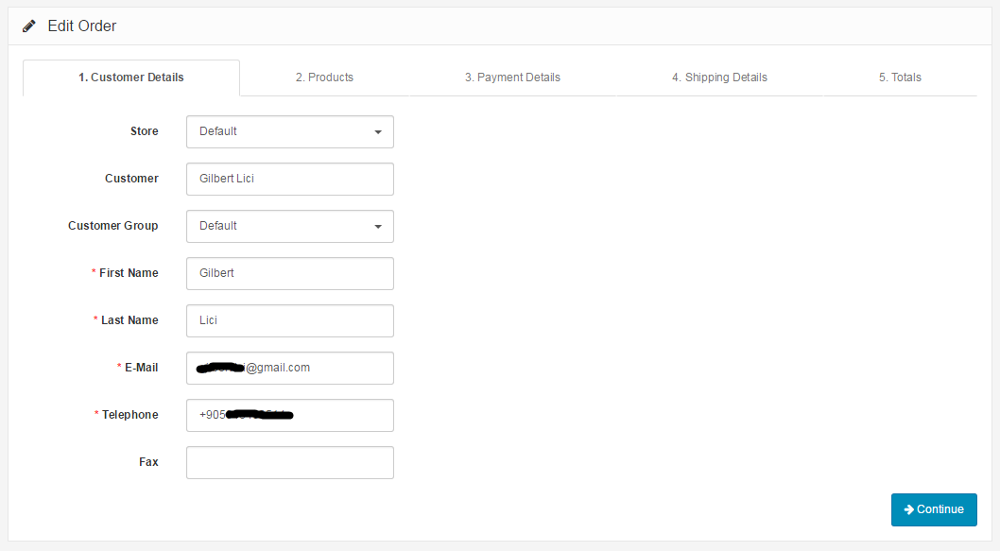
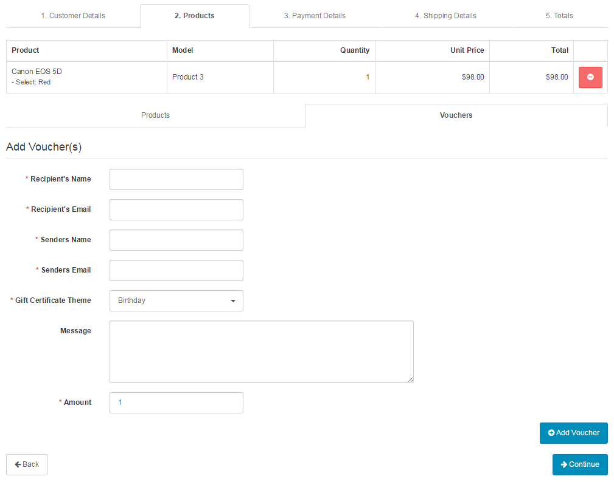
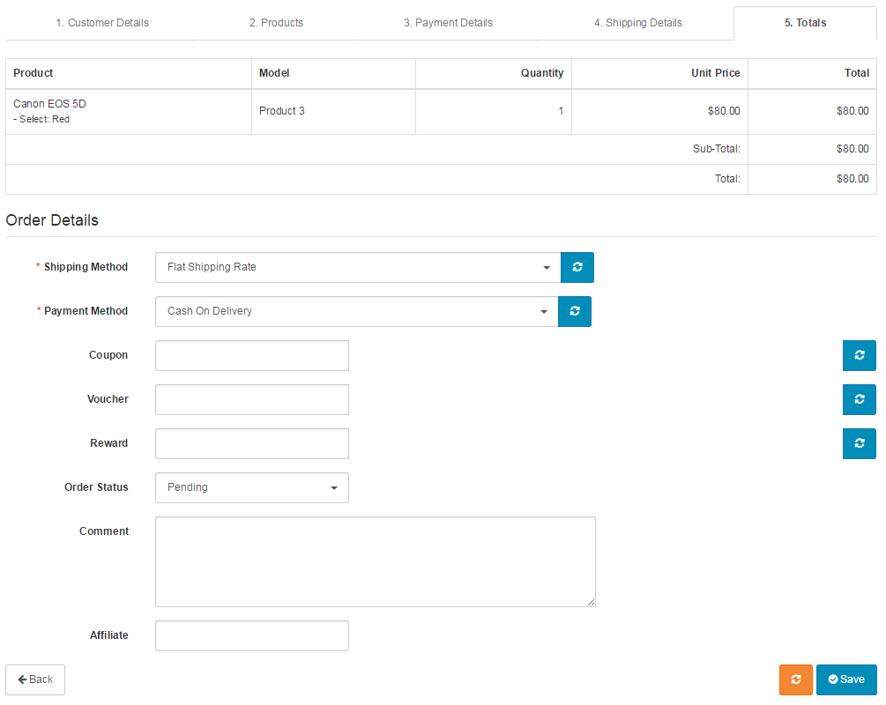

Orders
======

Managing orders
---------------

When a customer goes through checkout, the information on their order is automatically transferred to the Orders section for you to keep track of. In the administration, you can view all of the orders made on their site, manually add orders, or edit the details of existing orders.

Viewing order details
---------------------

The Orders section is located under Sales > Orders. On this page, every order ever made from the store is listed in detail.

The following details are displayed for each order on the list:

- **Order ID**: a number assigned to an order by Arastta during the checkout confirmation
- **Customer**: the name of the customer that made the order.
- **Status**: update of the status of the order. After the order is initially created the status will be "Pending". The default options are Missing Orders, Canceled, Canceled Reversal, Chargeback, Complete, Denied, Expired, Failed, Pending, Processed, Processing, Refunded, Reversed, Shipped, and Voided.
- **Total**: the total price of the order.
- **Date Added**
- **Date Modified**

****

With the orders included in the list, there is an option to edit, insert, delete, search, or print an invoice of an order.

### Searching for an order

The "Filter" button under Action helps you find orders based on the information specified in the blanks. It can help you locate orders by date added or customer. The "Filter" cannot search for orders by product purchased yet. For more information on the [Filter ](docs/user-manual/catalog/filters)tool, see Filter.

Manually adding/modifying an order
----------------------------------

Customer Orders will be automatically updated to the Order section after a customer confirms checkout. Though it is automatically updated, you may want to edit or add orders manually to add new information such as a gift-voucher, or add reward points. To manually add a new order, click the "Insert" button. To modify a pre-existing order, click "Edit" under Action.

### Customer details

The first section for modifying an order is called Customer Details. Typing in a customer name that has already made an account with the store will auto-complete the form by bringing up their information to fill in the blanks.

### Products

In "Choose Product", begin typing the product name. A drop down list will appear with products containing that name. Selecting a product from this list will bring up specific product options for this order.

### Vouchers

If a customer wants to add a gift voucher order, it will ask them for the following information.

### Payment details

If an address has been added to the customer, select their address option under "Choose Address". Otherwise the customer address will need to be manually filled into the form.

### Shipping details

This section tracks the shipping address for this particular order. If the shipping and payment address are the same, copy and paste the information above when adding it manually.

### Totals

Under Totals, other contributing payment factors, such as coupons and vouchers, are added/subtracted to the order total.

> Shipping and payment methods must already be set up to select a method in the order form. Otherwise, there will be nothing to select under Shipping Method and Payment Method.

The sections seen above (such as Coupon, Voucher, Rewards) are extensions that were enabled specifically for this form. There is an option to customize the order details included in the totals by editing, uninstalling, or enabling specific order total extensions.

Printing invoices
-----------------

To print an invoice, go back to the Orders page under Sales > Orders. Above the order list on the top right corner is the "Print Invoice" button. Select the order to be printed, and click "Print Invoice". This action will direct you to a printable page of the invoice. The invoice can be printed out and included in with the shipping.
