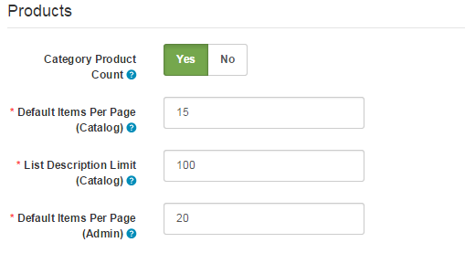
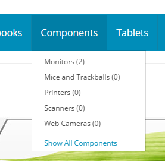
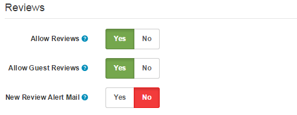
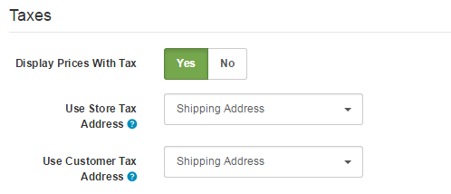
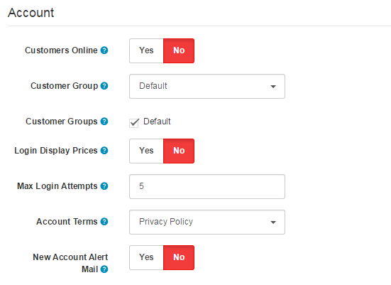
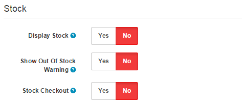
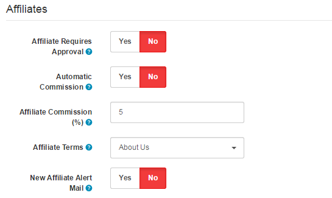

Option
===============

Option Tab
----------

The option tab under settings displays the following fields: Common, Products, Vouchers, Taxes, Account, Checkout, Stock, Affiliates, Returns:

### Common

- **Text Editor (Admin):** Admin panel all textarea filed text editor.

### Products

- **Category Product Count**: Selecting 'Yes' will display how many products are available within each subcategory of the parent categories located in the [Top Menu](docs/user-manual/store-front).

> If you have lots of categories, you can gain a significant performance improvement by not displaying the Category Product Count.

- **Default Items Per Page (Catalog):** The number of Catalog items that can be displayed in the store front. For example, a '5' will set a default view of 5 products to be displayed at a time per Product Category page or Manufacturer page. The customer can customize how many products can be viewed at a time in "Show" above the product list or grid. In the store front, this number of items per page will alter how many products are viewed in the Product Category page, the Manufacturer Page, and the Search page.
- **List Description Limit (Catalog):** In the list view, short description character limit (categories, special etc).
- **Default Items Per Page (Admin):** The number of Admin items that can be displayed in the administration. For example, a '10' will limit the number of customers listed under Customers > Customers to 10 displayed per page. This setting will affect the number items per page under:
  Catalog > Products, Recurring Profiles, Attributes, Options, Manufacturers, Downloads, Reviews, Information;
  Sales > Orders, Returns;
  Marketing > Customers, Affiliates, Coupons, Gift Vouchers;
  Appearance > Customizer, Layouts, Menus, Banners;
  Reports > Sales, Products, Customers, Marketing.
  The only way to change how many items viewed per page is under this tab.

### Reviews

- **Allow Reviews:** Enable/Disable new review entry and display of existing reviews.
- **Allow Guest Reviews:** Allow or do not allow guests to post reviews.
- **New Review Alert Mail:** Send an email to the store owner when a new review is created.

### Vouchers

- **Voucher Min:**The minimum amount that a customer can enter to purchase a gift voucher. The number added will be counted in the default currency.
- **Voucher Max:**The maximum amount that a customer can enter to purchase a gift voucher. The number added will be counted in the default currency.

### Taxes

- **Display Prices With Tax: **Selecting 'Yes' will display the estimated tax on the product's page under Price. Selecting 'No' will not show the customer the price of taxes until the checkout.
- **Use Store Tax Address: **The tax estimate will use either the store's shipping or payment address if the user isn't logged into their account with their address information.
- **Use Customer Tax Address: **The tax estimate will use the customer's shipping or payment address if they are logged into their store account.

### Account

- **Customers Online:** Track customers online via the customer reports section.
- **Customer Group:** Select the default customer group that a customer will be sorted into when they create an account. To edit a customer's customer group, see [Customers](docs/user-manual/customers/groups).
- **Customer Groups:** Lets the customer select what customer group to be assigned to when first creating their account.
- **Login Display Prices:** Selecting 'Yes' will require the user to create a customer account to see the prices of products in the store. Selecting 'No' will let anyone with access to the store see the product prices.
- **Max Login Attempts:** Maximum login attempts allowed before the account is locked for 1 hour. Customer and affliate accounts can be unlocked on the customer or affliate admin pages.
- **Account Terms:** If "About Us", "Delivery Information", "Privacy Policy", or "Terms and Conditions" is selected, the user will have to read and agree to the terms of those pages before creating an account with the store. Selecting "None" will let the user create an account without agreeing to any terms.
- **New Account Alert Mail:** Send an email to the store owner when a new account is registered.

### Checkout

- **Invoice Prefix: **Adds a prefix to each invoice order. Arastta will add an incremental number to the end of the prefix for every invoice. For more information on how to print an invoice, see [Orders](docs/user-manual/sales/orders).
- **API User:** Default API user the admin should use.
- **Display Weight on Cart Page: **Selecting 'Yes' will display the weight of a product at the top of the Checkout page. For the weight to be displayed, there needs to be a weight number added to the product under its Data tab. See [Products ](docs/user-manual/catalog/products/data)for more information.
- **Guest Checkout: **Selecting 'Yes' enables users to go through the checkout process without creating a store account. Selecting 'No' requires the user to create a store account before checking out.
- **Checkout Terms: **Selecting an Information page listed in the drop down box forces the user to agree to the terms of that page in "Step 6: Confirm Order" of checkout. Selecting 'None' lets the customer confirm their order without agreeing to any terms.
- **Order Status: **the default status of every order after the customer confirms in checkout. The customer can view the status of their order in the store front under My Account > My Orders. The status can be edited in the Order section. See Orders for more information.
- **Processing Order Status: **the default status for a processing order.
- **Complete Order Status: **the default status for a complete order.
- **New Order Alert Mail: **Send an email to the store owner when a new order is created..

### Stock

- **Display Stock:** the amount of product left in the store inventory.
- **Show Out Of Stock Warning:** displays the an Out of Stock warning on the product page in the store front, if the store is out of that particular order. A product will be out of stock if its quantity in the Data tab reaches 0. It will reach 0 if the subtract stock option is selected. This option subtracts a stock with every purchase of the product. See Products for more information.
- **Stock Checkout: **lets the customer checkout a product if it is out of stock.

### Affiliates

- **Affiliate Requires Approval: **Automatically approve any new affiliates who sign up.
- **Automatic Commission: **Automatically add commission when each order reaches the complete status.
- **Affiliate Commission (%): **the default percentage an affiliate will make from a customer purchase.
- **Affiliate Terms: **makes an affiliate agree to the terms on one of the Information pages in order to make an affiliate account.
- **New Affiliate Alert Mail: **Send an email to the store owner when a new affiliate is registered.

### Returns

- **Return Terms:** Forces people to agree to terms before a return can be created.
- **Return Status:** the default status a customer will see in their account after submitting a return form under Customer Service > Returns; displays either "Awaiting Products", "Completed", or "Pending".
