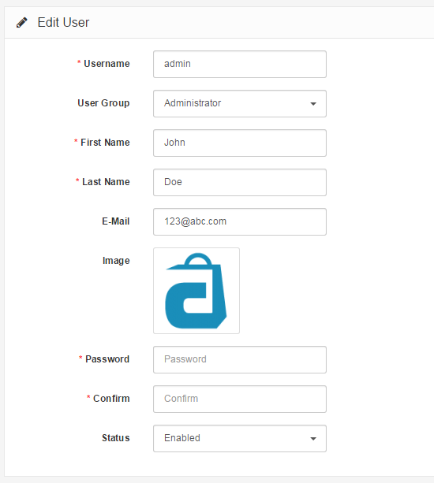

Users
=====

Managing the in's and out's of the admin side of an online store can be quite the task for just one person to handle. You may find it necessary to assign administration side permissions to specific people on your team. The User section lets you customize which users can access the admin side of the store, and what sections can be accessed or modified by them.

User groups
-----------

Before you begin creating user profiles, you should visit System > Users > User Groups to set specific access and modification permissions.

Arastta lets you customize which admin side pages can be accessed by the specific user groups. You must check which pages can be accessed under Access Permission, and which page content can be modified under Modify Permission. The pages in the box office are displayed according to the top menu sections. For example, catalog/attribute is the Attribute section under Catalog in the top menu of the dashboard.

> Be aware that checking sections in Access Permission lets the user see the information on those pages. If a page in Access Permission is selected, but the page in Modify Permission is unselected; the user will be able to view the information on the page, but will be unable to modify this information.

For the Co-worker group, we chose to allow access and permit modification to the Catalog Section only, but not the rest of the admin panel.

Arastta provides two user groups installed into the admin side, Top Administrator and Demonstration. The Top Administrator has every box checked under Access Permission and Modify Permission. It is an intuitive step that users assigned to the Top Administrator position would need access to all of the admin pages and permission to modify these sections. You can choose to leave the group unchanged, or unselect categories for this group. The Demonstration user group doesn't have any admin pages checked in Access Permission or Modify Permission, meaning users added in this group will not be able to access the admin side or modify any features of the shop.

Users
-----

With the user groups set up, the individual users can be saved to the administration side of your store under System>Users>Users. Clicking "Insert" will bring you to the user form below. Aside from the basic user information, a password must be created for the user to login to the dashboard. The User Group selected from the drop down box will assign specific permissions to the user. The status lets you choose to enable the user to be able to login, or disable the user from logging in to the dashboard.

### Permission denied

The user can access the dashboard the same way the administrator would, with the exception of entering their specific username and password. See [Admin interface](docs/user-manual/admin/overview) for more information.

Our user, John Doe, was assigned to the Co-worker group; meaning he will be able to access and modify all the Catalog pages. He will not be able to access Extensions, Sales, System, or Reports. The following screenshot displays what John Doe will view when he tries to access the Extensions page.

If John Doe was permitted access to this page, but not modify it, the following warning message would appear if he tried to save an edit:

"Warning: You do not have permission to modify categories!"
